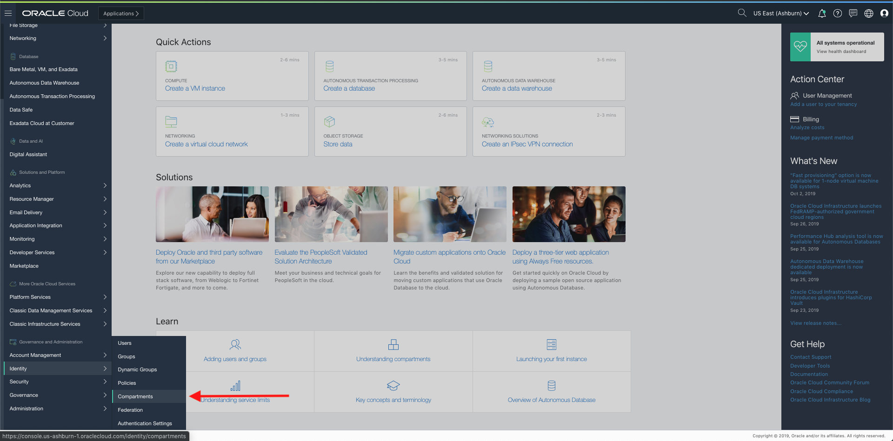
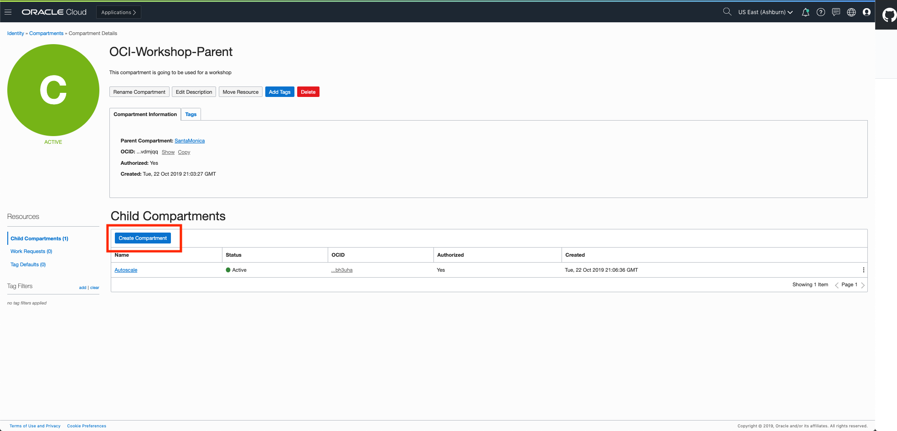
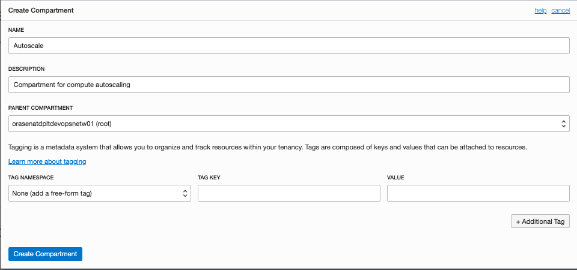
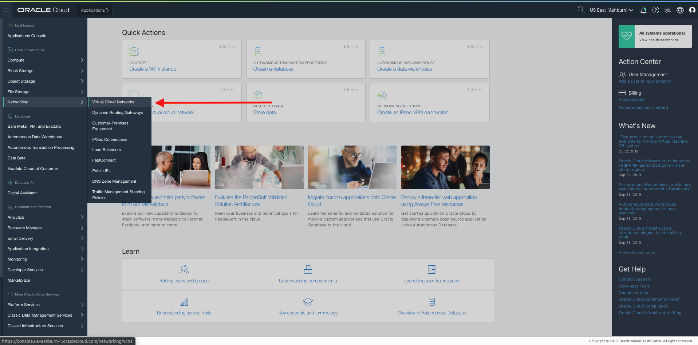
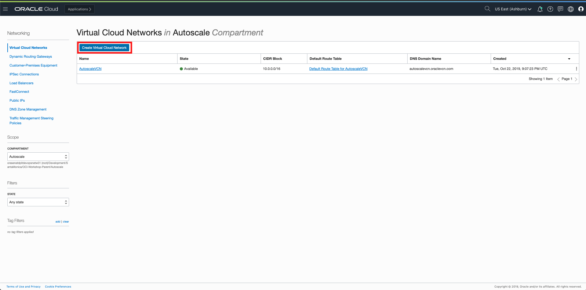
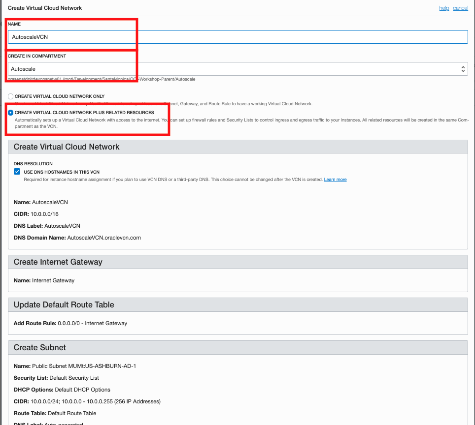

# OCI Workshop - Creating a compartment and Virtual Cloud Network

Updated: October 25th, 2019

This part of the lab builds the networking portion for our web application. 

***To log issues***, click here to go to the [github oracle](https://github.com/OracleMichael/ODA-Alexa-Workshop/issues/new) repository issue submission form.

## Objectives

- Obtain an Oracle Cloud Free Tier Account
- Create a compartment
- Create a Virtual Cloud Network

## Steps

### **STEP 1**: Your Oracle Cloud Account

- You have already applied for and received your Oracle Cloud Free Tier Account and will change the default password.

### **STEP 2**: Log in to your account

- Once you receive the **Your Cloud Account is fully provisioned** Email, make note of your **Username and Cloud Account Name**.   *Note: `Usernames are usually your email address.`*  You can login by clicking the Sign In button or access it from any browser.

  

- From any browser go to oracle.com to access our cloud: [https://www.oracle.com/](https://www.oracle.com/)

  

- Click the icon in the upper right corner.  Click on **Sign in to Cloud** at the bottom of the drop down.  *NOTE:  Do NOT click the Sign-In button, this will take you to Single Sign-On, not the Oracle Cloud*

  

- Enter your **Cloud Account Name** in the input field and click the **My Services** button. If you have a Free Tier account provisioned, this can be found in your welcome email. Otherwise, this will be supplied by your workshop instructor.

    

- Enter your **Username** and **Password** in the input fields and click **Sign In**.

   

  **NOTE**: You will likely be prompted to change the temporary password listed in the welcome email. In that case, enter the new password in the password field.

### **STEP 3**: Navigate to Compartments

You will navigate to the compartments sections your tenancy.

- Click the **hamburger icon** in the upper left corner to open the navigation menu. Under the **Identity** section of the menu, click **Compartments**. 

   

### **STEP 4**: Create a Compartment

When you first start working with Oracle Cloud Infrastructure, you need to think carefully about how you want to use compartments to organize and isolate your cloud resources. Compartments are fundamental to that process. Most resources can be moved between compartments. However, it's important to think through your compartment design for your organization up front, before implementing anything. 

The Console is designed to display your resources by compartment within the current region. When you work with your resources in the Console, you must choose which compartment to work in from a list on the page. That list is filtered to show only the compartments in the tenancy that you have permission to access. If you're an administrator, you'll have permission to view all compartments and work with any compartment's resources, but if you're a user with limited access, you probably won't.

Compartments are tenancy-wide, across regions. When you create a compartment, it is available in every region that your tenancy is subscribed to. You can get a cross-region view of your resources in a specific compartment with the compartment explorer.

Next, we will create a compartment within your tenancy. 

- Click the **Create Compartment** button on the left side of the screen. 

  

- On the following page click on create compartment and fill in the details as shown in the image below. Select root as the parent compartment in your case and then click create compartment.
  `
  Name: Autoscale-Compartment
  `

  

### **STEP 5**: Navigate to Virtual Cloud Networks

You will navigate to the Virtual Cloud Networks section in your tenancy.

- Click the **hamburger icon** in the upper left corner to open the navigation menu. Under the **Networking** section of the menu, click **Virtual Cloud Networks**. 

  
### **STEP 6**: Create a Virtual Cloud Network (VCN)

A virtual, private network that you set up in Oracle data centers. It closely resembles a traditional network, with firewall rules and specific types of communication gateways that you can choose to use. A VCN resides in a single Oracle Cloud Infrastructure region and covers a single, contiguous IPv4 CIDR block of your choice.

A VCN covers a single, contiguous IPv4 CIDR block of your choice. The allowable VCN size range is /16 to /30. Example: 10.0.0.0/16. The Networking service reserves the first two IP addresses and the last one in each subnet's CIDR. After you've created a VCN or subnet, you can't change its size, so it's important to think about the size of VCN and subnets you need before creating them.

For your VCN, Oracle recommends using one of the private IP address ranges specified in RFC 1918 (10.0.0.0/8, 172.16/12, and 192.168/16). However, you can use a publicly routable range. Regardless, this documentation uses the term private IP address when referring to IP addresses in your VCN's CIDR.

Next, we will create a virtual cloud network within the compartment you just created. 

- Click the **Create Virtual Cloud Network** button on the left side of the screen. 

  

- Provide a suitable name for the VCN and check the create virtual cloud network plus related resources radio button. Scroll down and click create VCN to spin up the VCN.

  

**This completes the compartment and virutal cloud network configuration**

**You are ready to proceed to [Lab 200](OCI-200.md)**

