# OCI Workshop: Web server on OCI

Updated: October 25th, 2019

This part of the lab will guide you through deploying a web server on OCI. 

## Objectives

-   Generate SSH Keys
-   Create Web Server on a Compute Instance

## Steps

### **STEP 1A**: Generate SSH Keys (Mac Linux)

- Generate ssh-keys for your machine if you don’t have one. As long as an id_rsa and id_rsa.pub key pair is present they can be reused. By default these are stored in ~/.ssh folder. Enter the following command in **TERMINAL**: (if you are using MAC or Linux Desktop: Once you run the command press enter for all of the options).

`
  ssh-keygen
`

  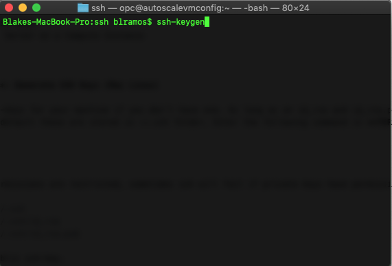
  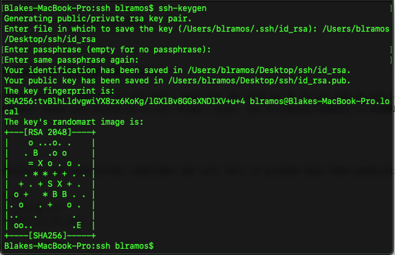
  
- Make sure permissions are restricted, sometimes ssh will fail if private keys have permissive permissions. Enter the following:

  `
  chmod 0700 ~/.ssh
  `
  
  `
  chmod 0600 ~/.ssh/id_rsa
  `
  
  `
  chmod 0644 ~/.ssh/id_rsa.pub
  `

  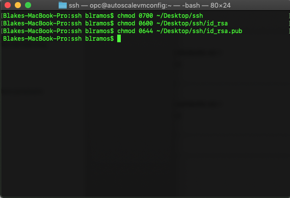
  
- To view and copy your public ssh key **navigate** to where you created your sshkeys and **enter the following**:

`
  vi id_rsa.pub
`

  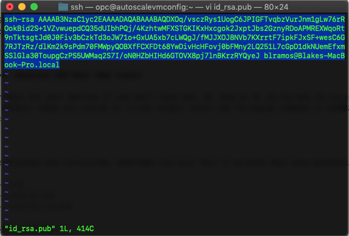
  
- You will be using the public ssh-key later on in the workshop. Make sure to copy it to a notepad or textedit as you will be using it later on in the lab.

### **STEP 1B**: Generate SSH Keys (Windows)

- Install git for windows. Download [Gitbash](https://github.com/git-for-windows/git/releases/download/v2.13.0.windows.1/Git-2.13.0-64-bit.exe) and install.

- Open Git-bash.

- **NOTE**: If you want to create your ssh keys in a specific folder. You must do the following:

  - **Navigate** to where you want to store your ssh keys and **enter** the following:
  
    `
    mkdir .ssh
    `
    
    `
    touch id_rsa
    `
    
   - **Enter**:
   
     `
     ssh-keygen
     `
   
   - **Read** the output and specify the file path you want the keys to be saved in.
   
   
   - If you want to store your ssh keys in the default folder please continue the lab.
   
- Generate ssh-keys by running this command in Gitbash and hit **enter** for all steps:

`  
  ssh-keygen
`
  
- Navigate to where you created you sshkeys. **Enter the following:**

`
  vi id_rsa.pub
`

- You will be using the public ssh-key later on in the workshop. Make sure to copy it to a notepad or textedit as you will be using it later on in the lab. 

### **STEP 3**: Navigate to Compute
You will navigate to the Virtual Cloud Networks section in your tenancy.

- Click the **hamburger icon** in the upper left corner to open the navigation menu. Under the **Compute** section of the menu, click **Instances**.

   

### **STEP 4**: Creating a Web Server on a Compute Instance
Oracle Cloud Infrastructure offers both Bare Metal and Virtual Machine instances:

**Bare Metal**: A bare metal compute instance gives you dedicated physical server access for highest performance and strong isolation.

**Virtual Machine**: A Virtual Machine (VM) is an independent computing environment that runs on top of physical bare metal hardware. The virtualization makes it possible to run multiple VMs that are isolated from each other. VMs are ideal for running applications that do not require the performance and resources (CPU, memory, network bandwidth, storage) of
an entire physical machine.

An Oracle Cloud Infrastructure VM compute instance runs on the same hardware as a Bare Metal instance, leveraging the same cloud-optimized hardware, rmware, software stack, and networking.

- Click **Create Instance**

  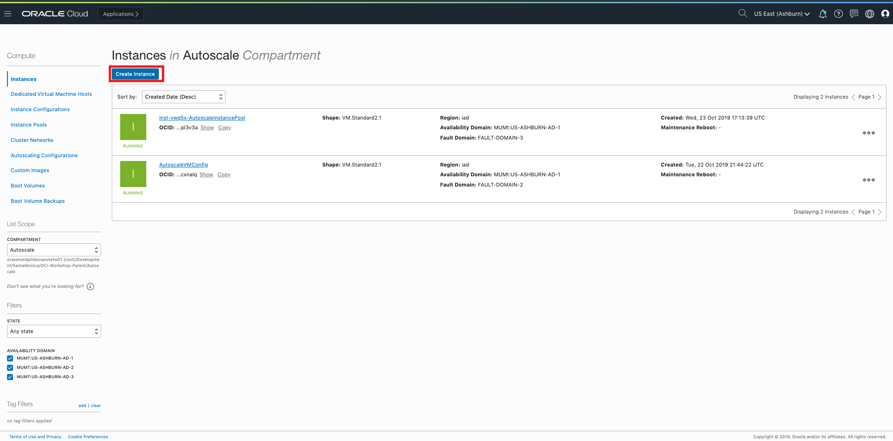
  
- In the form, please input the following details and then click create:

  Name → AutoscaleVMConfig
  
  OS image source → default
  
  Availability Domain → AD1
  
  Instance type → VM
  
  Shape → VM.Standard2.1
  
  VCN Compartment → Autoscale (compartment made in first step)
  
  VCN → AutoscaleVCN
  
  Subnet Compartment → Autoscale (same as VCN compartment)
  
  Subnet → Default populated
  
  SELECT: "Assign a public IP address"
  
  Choose or paste your ssh keys in the respective field.

  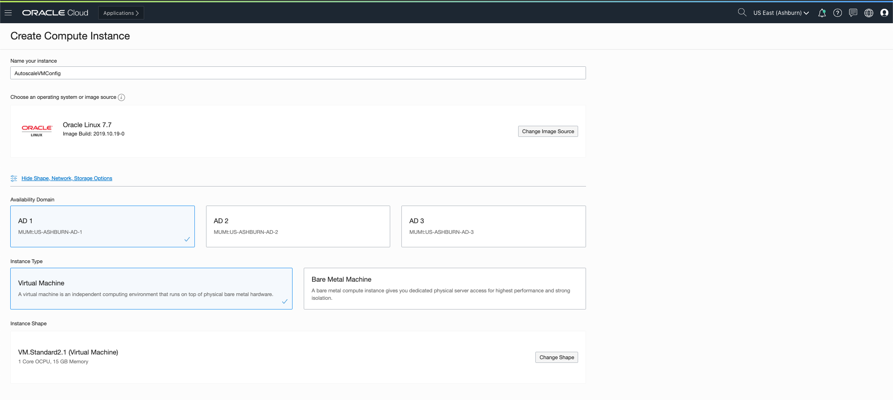 
  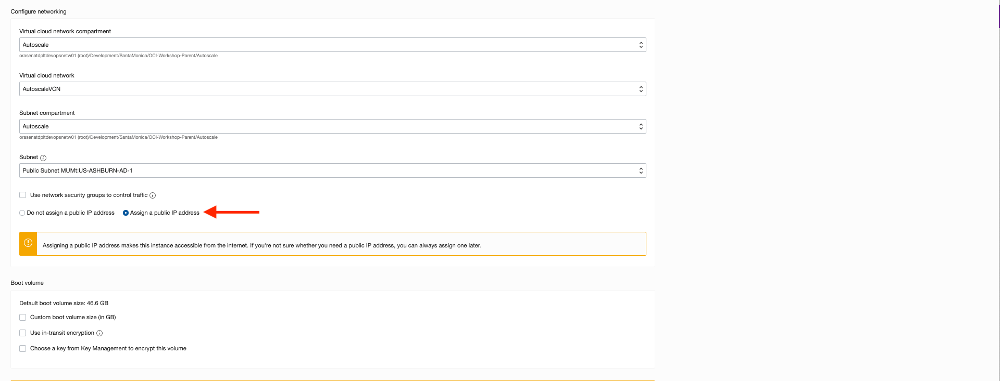 
  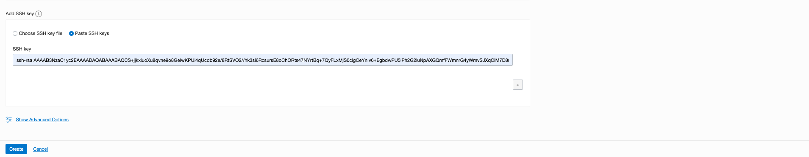 
  
- Click **Create** and wait for the instance to provision

### **STEP 4**: Launch the Compute Instance
Launching an instance is simple and intuitive with few options to select. Provisioning of the
compute instance will complete in less than a minute and the instance state will change from provisioning to running.

Once the instance state changes to Running, you can SSH to the Public IP address of the instance.

- Copy compute instance **Public IP address**

  
  
- To connect to the instance, you can use  Terminal if you are using MAC or  Gitbash if you are
using Windows. On your terminal or gitbash enter the following command:

`
  ssh opc@<public_ip_address>
`
  
- If you have a different path for your SSH key enter the following:

`
  ssh -i <path_to_private_ssh_key> opc@<public_ip_address>
`
  

### **STEP 5**: Apache HTTP Webserver installation

**Note**: Apache HTTP Server is an open-source web server developed by the Apache Software Foundation. The Apache server hosts web content, and responds to requests for this content from web browsers such as Chrome or Firefox.

We are going to install an Apache HTTP Webserver and try to connect to it over the public Internet. 

- In the terminal window that you are connected to your instance via SSH. Enter the following commands:

`
  sudo yum install httpd -y
`

  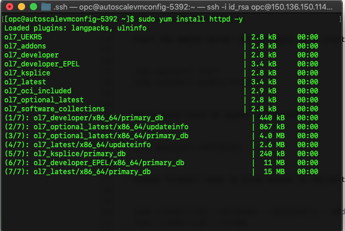
  
- Start the Apache Server and configure it to start after the system reboots. Enter the following:

`
  sudo apachectl start
`

`
  sudo systemctl enable httpd
`

- Run a quick check on apache configurations. Enter the following:

`
  sudo apachectl configtest 
`  

- Create firewall rules to allow access to the ports on which the HTTP server listens:

`
  sudo firewall-cmd --permanent --zone=public --add-service=http
`

`
  sudo firewall-cmd --reload
`

- Create an index file for your webserver:

`
  sudo bash -c 'echo This is my Web-Server running on Oracle Cloud Infrastructure >> /var/www/html/index.html'
`

  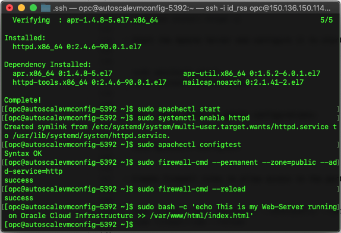

### **STEP 5**: Access Webserver

- Open your browser and navigate to  http://Public-IPAddress (the IP address of the Linux VM)
**Note:** Your browser will not return anything. This is because port 80 was not opened into the Security lists. Before we can access our web application we must add an ingress rule.

- Click the **hamburger icon** in the upper left corner to open the navigation menu. Under the **Networking** section of the menu, click **Virtual Cloud Networks**.

  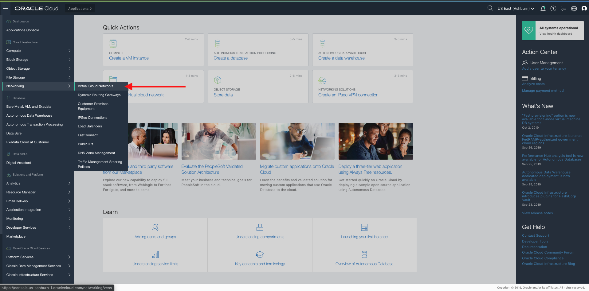

- Select the Virtual Cloud Network you created before.

- Select Security Lists

  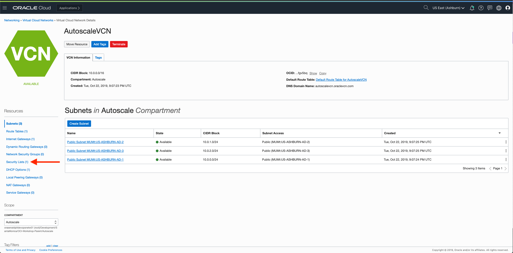

- Select "Default Security List for AutoScaleVCN"

- Select "Add Ingress Rule"
  
  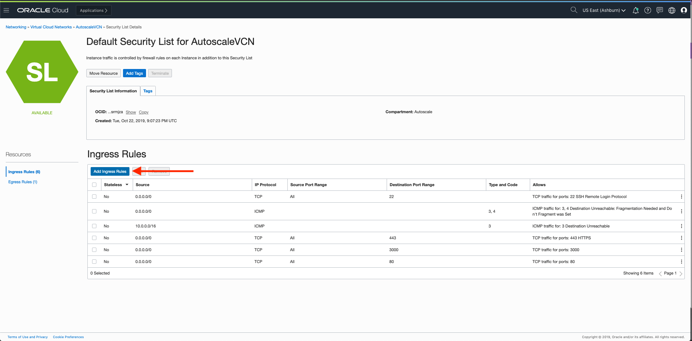
  
- Add the following values:

  Source Type: CIDR
  
  Source CIDR: 0.0.0.0/0
  
  IP Protocol: TCP Source Port Range: All Destination Port Range: 80
  
  Click on Save Security List Rules at the bottom. 
  
  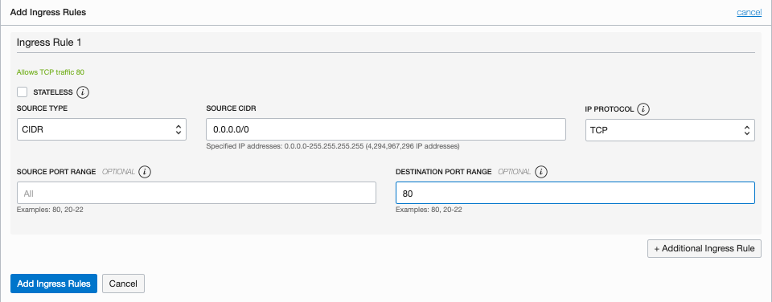
  
- Click "Add Ingress Rule"

- Open your browser and navigate to  http://Public-IPAddress (the IP address of the Linux VM). You should be able to see the index file you created earlier. 

  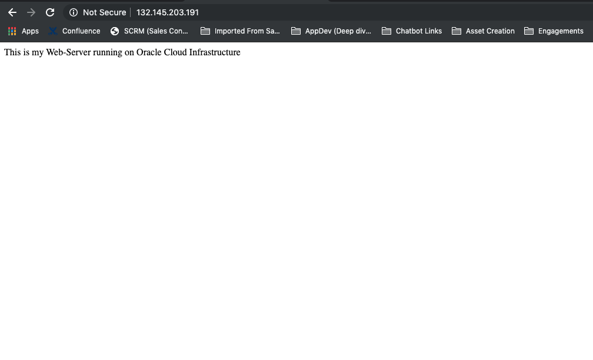

**This completes the Web Application deployment!**

**You are ready to proceed to [Lab 300](OCI-300.md)**

