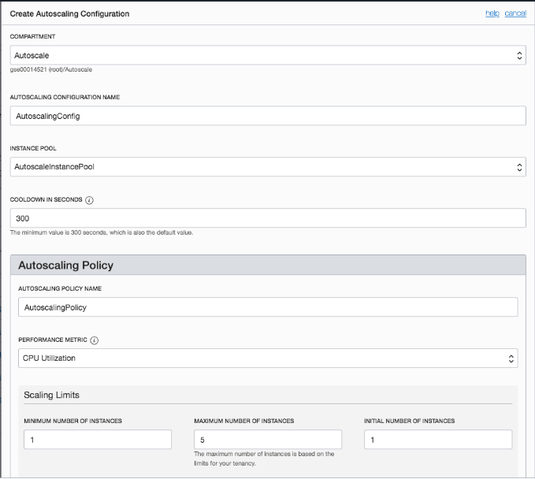

# OCI Workshop: Autoscaling

Updated: October 25th, 2019

Autoscaling enables you to automatically adjust the number of Compute instances in an instance pool based on performance metrics such as CPU and memory utilization. This helps you provide consistent performance for your end users during periods of high demand, and helps you reduce your costs during periods of low demand.

## Objectives
- Showcase autoscaling capabilites
- Scale deployed compute instance

### **STEP 1**: Create an Instance Configuration

- Click the **hamburger icon** in the upper left corner to open the navigation menu. Under the **Compute** section of the menu, click **Instances**.

  
  
- Click on **Create Instance Configuration**

  
  
### **STEP 2**: Create an Instance Pool

- On the instance configuration page select the configuration we created in the previous step. On the resulting page click on create instance pool.

  
  
- Select the compartment, and provide a suitable name for the instance pool. Increase the number of instances to 5.
In the AD selection, select AD1, and select the same compartment for both VCN and subnet and select the corresponding VCN (AutoscaleVCN) and Subnet (name ending with AD-1). Click create instance pool.

  
 
- The instances will be provisioned and it might take a few minutes. 

### **STEP 2**: Create an Autoscaling Configuration

- Once the instances in the instance pool are up and running, click on actions → Create Autoscaling Configuration on the instance pool page.

  
  
- Select the right compartment and provide a suitable name.
- Select the instance pool we created in the previous step and keep cooldown time as default. 
- In the Autoscaling policy section, provide a suitable name and choose CPU utilization as the performance metric.
  
  
  
- In the following section on scaling rules, add the following rules and then click create.

`
  Scale-out parameter → Greater than (>)
  Threshold percentage → 30
  Number of Instances to Add → 1
  Scale-in parameter → Less than (<)
  Threshold percentage → 20
  Number of Instances to Remove → 1
`

  

- The instance pool will now scale down to the minimum number of instances set in the autoscaling configuration.

### **STEP 3**: Induc CPU Stress on the Instance to Demonstrate Autoscaling
- Copy the **Public IP address** of the compute instance running in your instance pool 
  
  
- To connect to the instance, you can use  Terminal if you are using MAC or  Gitbash if you are
using Windows. On your terminal or gitbash enter the following command:

`
  ssh opc@<public_ip_address>
`
  
- If you have a different path for your SSH key enter the following:

`
  ssh -i <path_to_private_ssh_key> opc@<public_ip_address>
`
  
  
- Run the following linux commands:

`
  sudo su
  yum install stress
  stress --cpu 2 --timeout 300s
`

  

- These commands will increase CPU utilization of Linux instance for a time of 5 mins which is enough time for OCI to detect that CPU utilization is above threshold and thus will start autoscaling to add 1 instance in the instance pool. Following another inactive period of monitoring, OCI will remove the added instance based on scale down configuration.

  

**This completes the OCI Workshop!**

