# OCI Workshop: Deploy a simple web app with Terraform and Oracle Resource Mananger

Updated: November 2nd, 2019

The Oracle Cloud Infrastructure Resource Manager is a fully managed service that lets you
provision infrastructure resources on Oracle Cloud Infrastructure using Terraform. You can bring in your Terraform template denition and easily create and manage your infrastructure resources. This allows you to use infrastructure-as-code to automate provisioning across all OCI resources including Compute, Networking, Load Balancers, Block and Object Storage.

Resource Manager also integrates with Identity and Access Management (IAM) so you can define granular permissions for Terraform operations. It currently has support for CLI, SDK and Console.

## Objectives
- Configure IAM to control user access in Resource Manager
- Create Resource Mananger Stack
- Execute Jobs: Plan, Apply, and Destroy. 

### **STEP 1**: Configure IAM to control user access in Resource Manager
**Download**: [Terraform.zip](https://objectstorage.us-ashburn-1.oraclecloud.com/p/5KTZuzZYkrJrVC4MSulq_TYeuGK5E4jPYNH3Zi3PwvA/n/orasenatdoracledigital01/b/terraformScripts/o/terraform.zip) file.

**Note**: You can skip the steps below if you are using an user with admin privileges. If this were a real production system, it’s both more secure and practical to create additional groups with more granular permissions. For example, it is likely we’d need to create a development team group that can only use predened stacks and run jobs against it (use-orm-stack and use-orm-job, respectively). 

- Click the **hamburger icon** in the upper left corner to open the navigation menu. Under the **Identity** section of the menu, click **Policies**.

  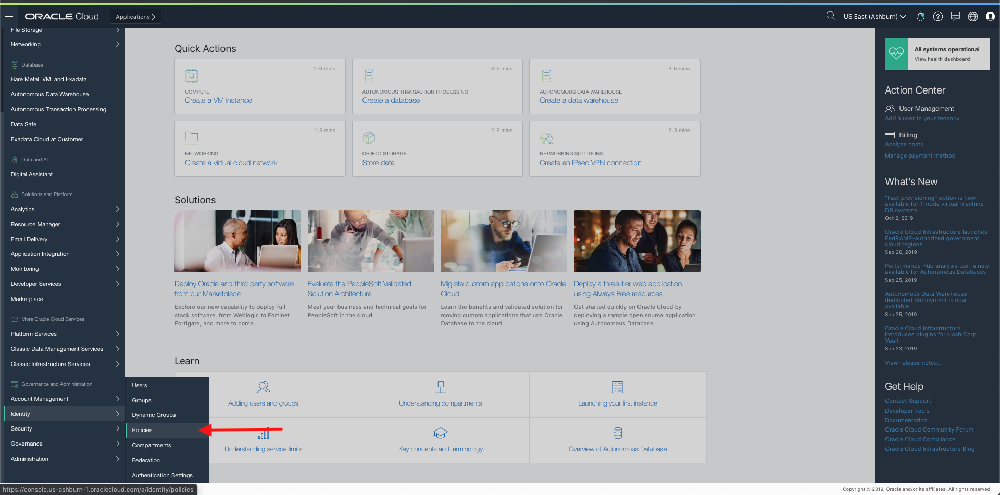
  
- Click on **Create Policy**

  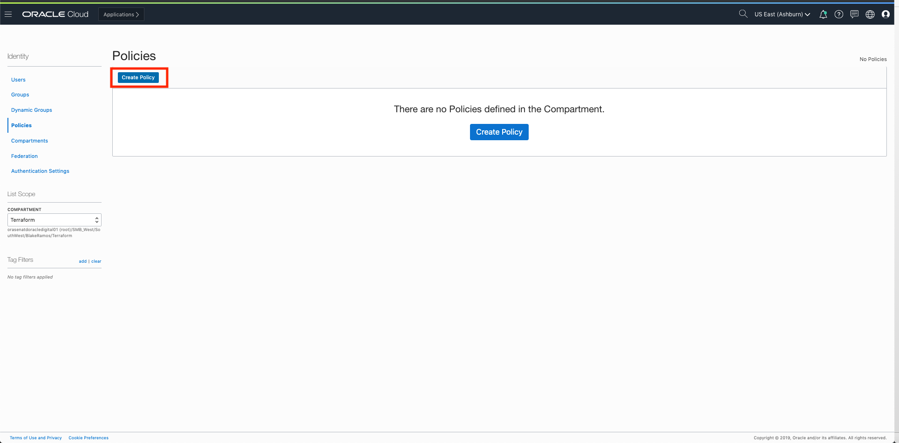

- Next, fill in the following fields listed below:

- Name: orm-admin-policy
- Description: Admin policy over all Resource Manager Stacks and Jobs in the OCI-ORM
compartment
- Add the following statements: 
  - Allow group orm-admin-group to manage orm-stacks in compartment OCI-ORM
  - Allow group orm-admin-group to manage orm-jobs in compartment OCI-ORM
- Click create

  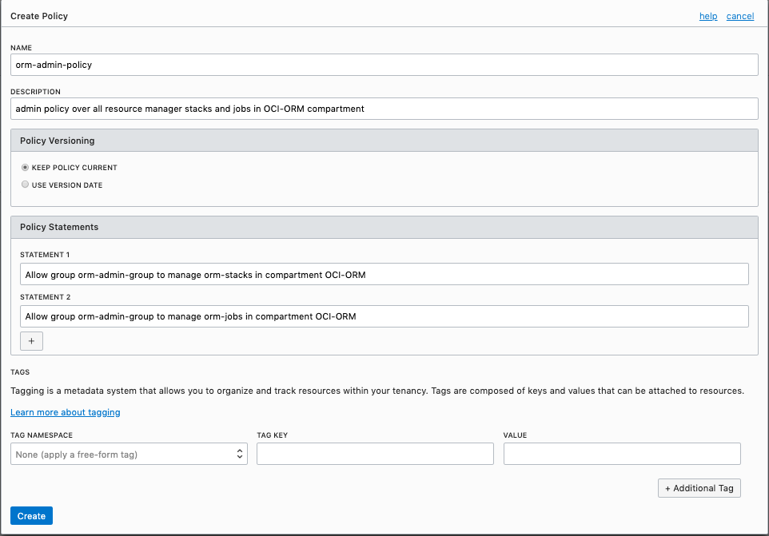

  
### **STEP 2**: Create Resource Stack Manager
A Stack represents definitions for a collection of OCI resources within a specic compartment. With this in mind, we’re going to congure a new stack in the OCI-ORM compartment in the us-phoenix-
1 region and name it “HA Load Balanced Simple Web App”. As the stack’s name suggests, its conguration includes the load balancing, networking, and compute resources to deploy the target architecture plus an HTTP server.

-**IMPORTANT BELOW PRE-REQUISITE:**
- Before starting this step download the terraform.zip that will be provided.
- Generate public and private ssh keys or use previous ssh keys (id_rsa.pub & id_rsa)
- **Upload** id_rsa to terraform folder and **zip** the folder. 

- Click the **hamburger icon** in the upper left corner to open the navigation menu. Under the **Resource Manager** section of the menu, click **Stacks**.

  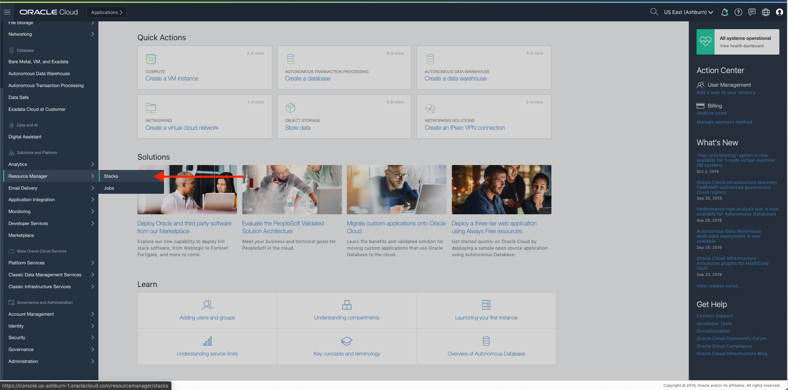

- Click **Create Stack**

- Select a Terraform Configuration (.zip) File to Upload: Upload the zip **terraform.zip**
  
- Click **Next**

- Configure **Variables**
  - **Region**: us-ashburn-1
  - **Compartment_OCID**: go to identity -> compartments -> copy your compartment ocid
  - **SSH_Public_Key**: paste your public ssh key
  - **SSH_Private_Key**: id_rsa
  
  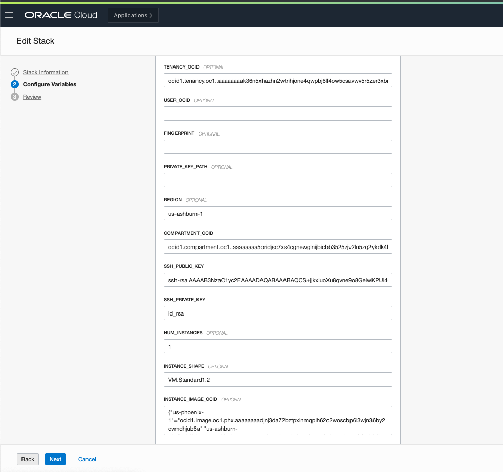
  
- Click **Next**

- Verify your stack information and variables

  

- Click **Save Changes**

### **STEP 2**: Execute Jobs: Plan, Apply, Destroy

Jobs perform actions against the Terraform conguration associated with a stack. You can perform 3 actions and they are plan, apply and destroy. Since Terraform command execution is not atomic, it is crucial to prevent any race conditions or state corruption from occurring due to parallel execution. To prevent this from happening, the Resource Manager ensures only one job can run against a stack at a given time against a single state.

From the Stack Details page, we can completely manage the stack’s conguration (i.e., update, delete, add tag/s, edit variables) and also download the zip archive containing the latest Terraform conguration - which can be especially helpful when troubleshooting.
  
- Lets execute a plan by clicking **Terraform Actions -> Plan** and enter the following:
  - **Name:** HA LB App Plan
  - Click **Plan**
  
  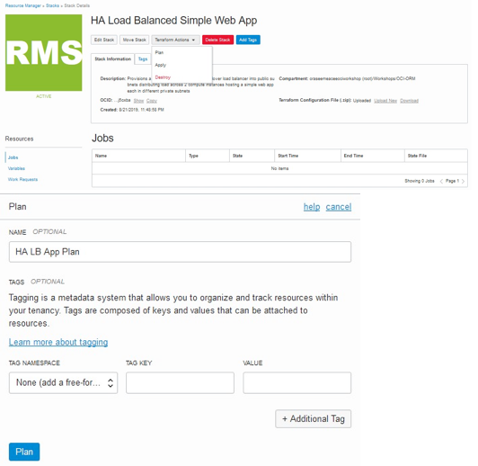
  
- **Note:** Once the modal closes, notice the job’s state appears as “Accepted” - which indicates
that the platform is spinning up resources needed for executing the command - followed by
“In Progress” and then either “Succeeded” or “Failed”. 

  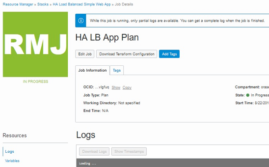
  
- Once the job succeeded, on the Job Details page review the information and scroll through
the logs containing the Terraform output. You may also edit the job or download the
Terraform Conguration and logs.

  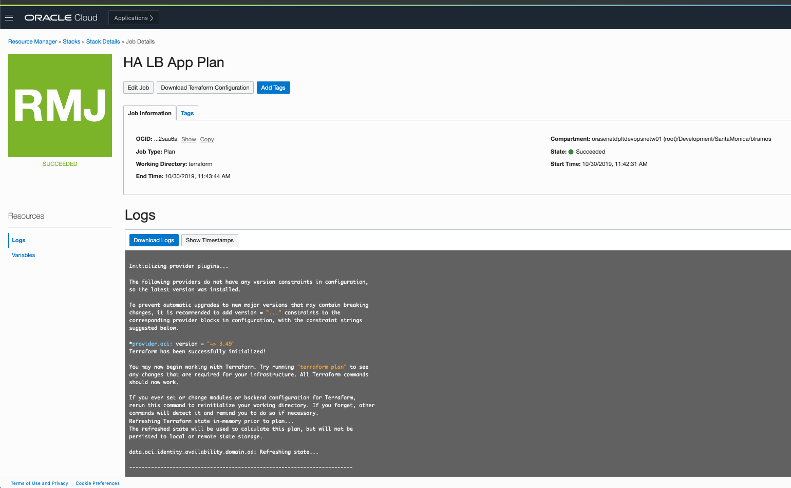

- Since the previous plan action succeeded, lets go back to the Stack page by clicking the HA Load Balanced Simple Web App breadcrumb on top of the page. On the Stack details page you can select the Apply from the Terraform Actions menu. Click on **Terraform Actions –> Apply**

  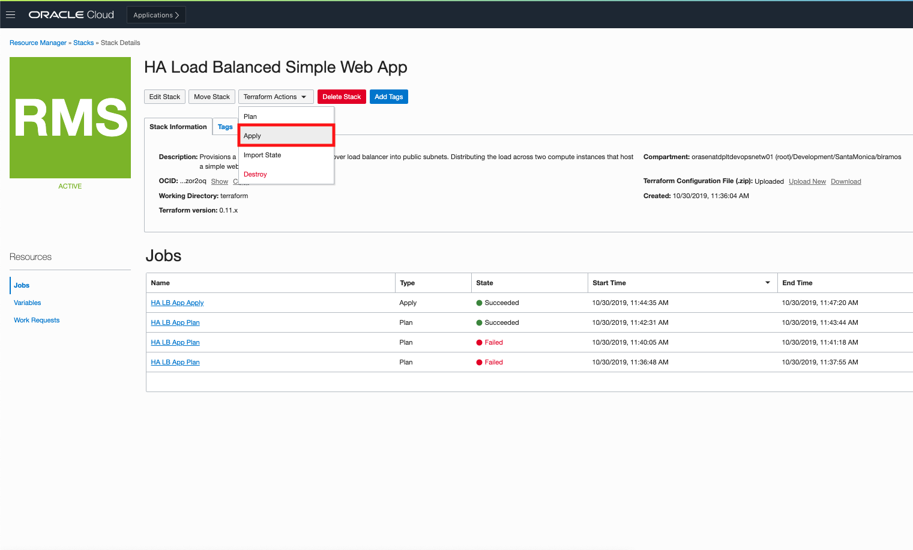
  
- Enter the following information:
  - **Name**: HA LB App Apply
  - **Apply Job Plan Resolution:** HA LB App Plan...
  - **Click**: Apply

  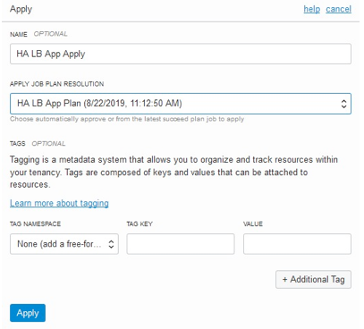
  
- The job state is updated as the job execution nears completetion:

  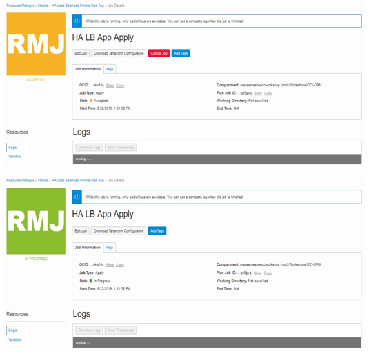

- Once the job has complete, scroll down to the bottom of the logs to see your **public ip address*

  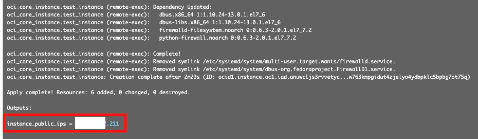

- Copy that IP address and **paste** it into a new tab.

  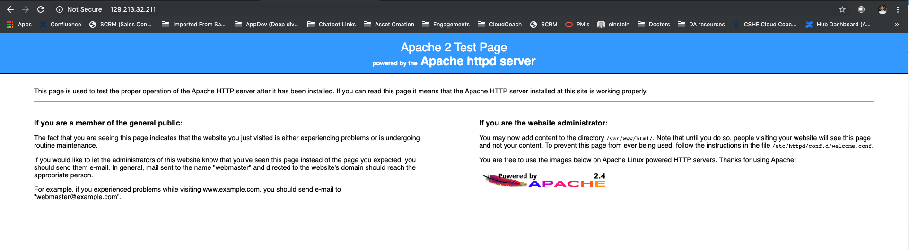

- You should see that you have successfully deployed an Apache HTTP Server.

### **STEP 2**: OPTIONAL STEP

Now that we’ve successfully applied our Terraform to build out our cloud resources, let’s
return to the Stack Details page and use the Resource Manager to tear it all down by clicking on **Terraform Actions –> Destroy** and enter the following information:

- **Name**: HA LB App Destory

- Click **Destroy**

This will tear everything down without having to do it manually. 

**This completes the Terraform Setup!!!!**
