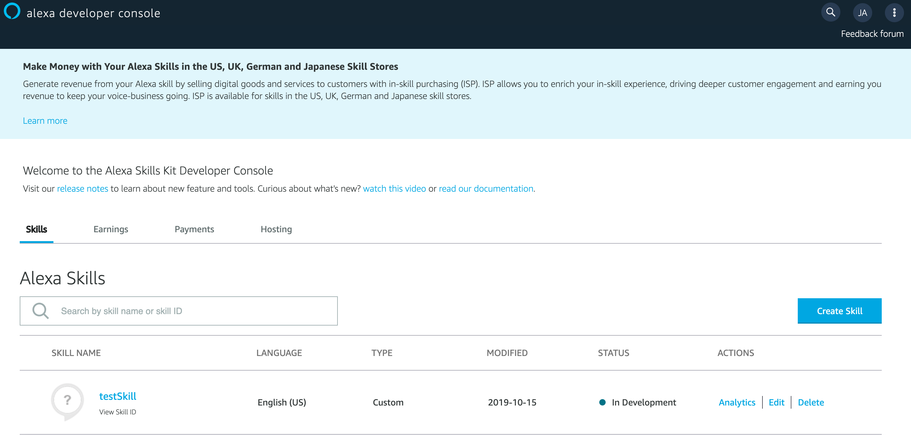
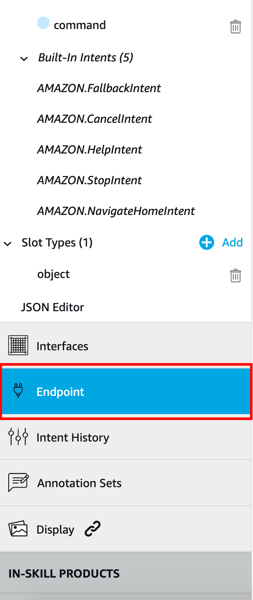
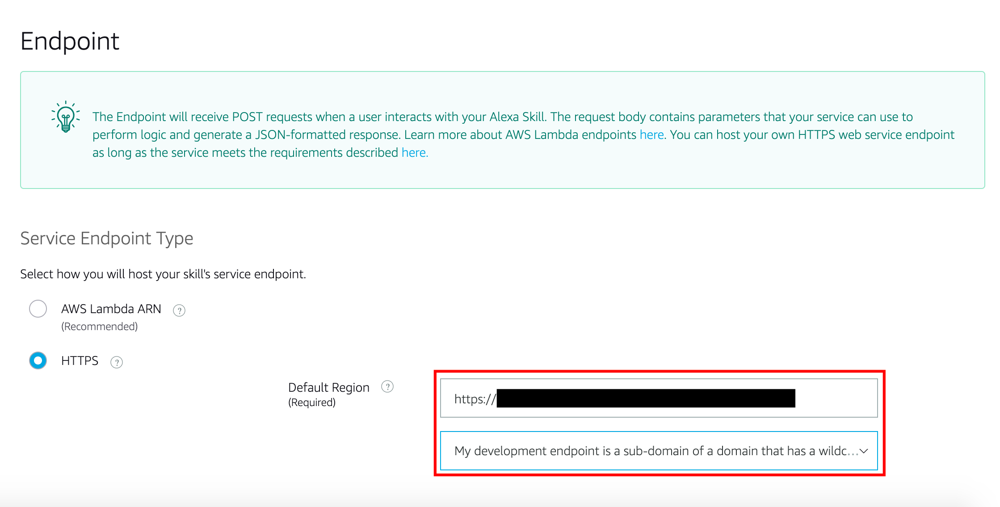

# ODA-Alexa Integration - Heroku Node Server Setup

Updated: October 17th, 2019

## Objectives
- Create Heroku account
- Set up Heroku on local computer
- Create a Heroku Application
- Configure webhooks
    - Update Digital Assistant channel URL
    - Update Amazon endpoint
- Configure and deploy NodeJS server
    - Update Amazon AppID
    - Update Channel Secret Key and Channel URL
    - Modify `package.json`
- Test the application

## Required Artifacts
- Oracle Digital Assistant Skill
- Heroku Account
- **Download the NodeJS code [here](https://app.compendium.com/api/post\_attachments/32ab85fd-0f44-4856-a79f-91a61359717b/view)** and unzip the zip file. The code has the following structure:
```
MyAlexaWebhook
  index.js
  invocation.json
  package.json
  README.md
  server.js
```

# Create Heroku Account
Follow this [link](https://signup.heroku.com/?c=70130000001xDpdAAE&gclid=Cj0KCQjwuZDtBRDvARIsAPXFx3DyRB323ksXfO_lYs7W14RB6CRCTQjMBNQTOuElUazr4rbuGysu78waAvLDEALw_wcB) to create a Heroku account. 

# Set up Heroku on local computer
Follow this [link](https://devcenter.heroku.com/articles/getting-started-with-nodejs#set-up) to set up Heroku on a local computer. For macOS, either the brew command or the download will install Heroku. To check on macOS, open a terminal (press command+space and search "terminal") and run `command -v heroku`. If you see something along the lines of `/usr/.../heroku` then heroku is installed.

# Heroku application deployment setup
## Follow the below steps to create an app in heroku and deploy the sample code
### **STEP 1**: Go to heroku dashboard and create an app
- Click **New** and then **Create new app**.
  
- You may optionally enter a unique app name. If you choose not to, Heroku will generate one for you.
  ***OR***
  Create an app from the [command line interface](https://devcenter.heroku.com/articles/creating-apps).


### **STEP 2**: Open NodeJS directory
- In your terminal (macOS/linux: terminal; windows: install git bash), go **INTO** the nodejs directory you downloaded. For instance, if the zip file was downloaded to your downloads folder, run
```
cd Downloads/MyAlexaWebhook
```
- Run the following commands in terminal:
```
heroku login
git init
heroku git: remote -a <INSERT APP NAME>
```

# Configure webhooks
## In this section we will use the Heroku application name to finalize the webhook URLs.
### **STEP 1**: Go to your Oracle Digital Assistant Instance

### **STEP 2**: Navigate to the channel you created in lab 050, step 5
- Change the **Outgoing Webhook URI** to `https://HEROKU_SERVER_NAME.herokuapp.com/singleBotWebhook/messages` where `HEROKU_SERVER_NAME` is the name of the Heroku application.

### **STEP 3**: Go to your Alexa Skill
- Click on your skill to open the development console.

### **STEP 4**: Navigate to endpoints
- Click on "Endpoints" on the left-hand navigation menu.

### **STEP 5**: Configure the endpoint
- Select HTTPS. Edit the **default region** module.
- The **URL** will be `https://HEROKU_SERVER_NAME.herokuapp.com/alexa/app`.
- Select "My deployment endpoint is a sub-domain of a domain that has a wildcard certificate from a certificate authority".

 
# Deploy nodejs application
## Before we redeploy the NodeJS application we need to make some changes in `service.js`.
### **STEP 1**: Open `service.js` in a code editor
- You may use VSCode (shown), your favorite Integrated Development Environment (IDE), Notepad, ViM, etc.

### **STEP 2**: Change amazon application ID in `service.js`
- Use the amazon application id (see lab 100 step 5) and copy it here:

### **STEP 3**: Change channelSecretKey in `service.js`

### **STEP 4**: Change channelUrl in `service.js`

### **STEP 5**: Modify `package.json`
- Inside of the nodejs server you downloaded there is a file called `package.json`. Replace its contents with the code below. 
```
{
  "name": "oracle-bot-alexa",
  "version": "1.0.0",
  "description": "Alexa integration",
  "main": "service.js",
  "author": "",
  "license": "",
  "dependencies": {
    "@oracle/bots-node-sdk": "2.0.6",
    "alexa-app": "^4.2.0",
    "body-parser": "^1.15.2",
    "express": "^4.14.0",
    "pubsub-js": "^1.5.4",
    "underscore": "^1.8.3",
    "util": "^0.10.3"
  },
  "scripts": {
    "start": "node index.js"
  }
} 
```
### **STEP 5**: Deploy nodeJS application
- Open up terminal and navigate to your directory to where you NodeJS server is located. Run these commands:
```
git add .
git commit -am "redeploying with correct variables"
git push heroku master
```

# Test the application
## We will test the application using the Alexa Developer Console.
### **STEP 1**: Test in Alexa Developer Console
Navigate to your alexa skill and select the test tab. You will be able to interact with you newly created skill by typing or using your microphone. The format to test is as follow:
```
Alexa, ask <invocation name> <question you programmed in a Digital Assistant>
```
### **STEP 2**: TODO


**This completes the ODA-Alexa Integration Workshop!**

